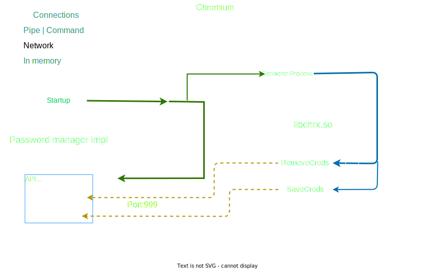

# Safe-chrx
A chromium build with an improved password manager and prototype implementation of [chrx-design](https://github.com/chrxer/chrx-design/tree/main/chrx).

## Why?
Chromium's native password manager is **poorly implemented** (see [password_harvester.py](https://github.com/kaliiiiiiiiii/PublicDuckyChallenger/blob/master/pass_harvester/password_harvester.py)) with the following excuse [source](https://chromium.googlesource.com/chromium/src/+/HEAD/docs/security/faq.md#why-arent-physically_local-attacks-in-chromes-threat-model)

> We consider these attacks outside Chrome's threat model, because there is no way for Chrome (or any application) to defend against a malicious user who has managed to log into your device as you, or who can run software with the privileges of your operating system user account.

## How?
Our password manager requires a **master password** when autofilling the first time after startup. All credentials are stored encrypted on the user's disk over that password.

## Architecture

## Roadmap
See [roadmap](roadmap/)

## Building

see [CONTRIBUTING.md](CONTRIBUTING.md)

## Developers
Integrated as a school-project \
[@kaliiiiiiiiii](https://github.com/kaliiiiiiiiii) aka Steve (Single dev) \
[@The-An0nym](https://github.com/The-An0nym)

## Sponsors
None yet:(
